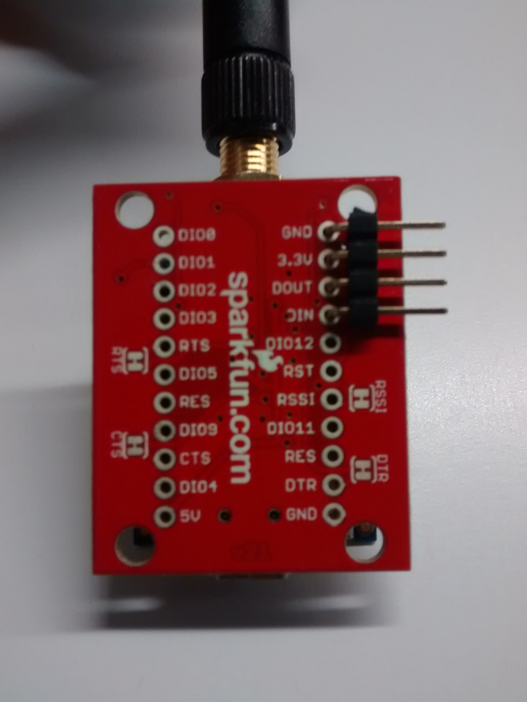
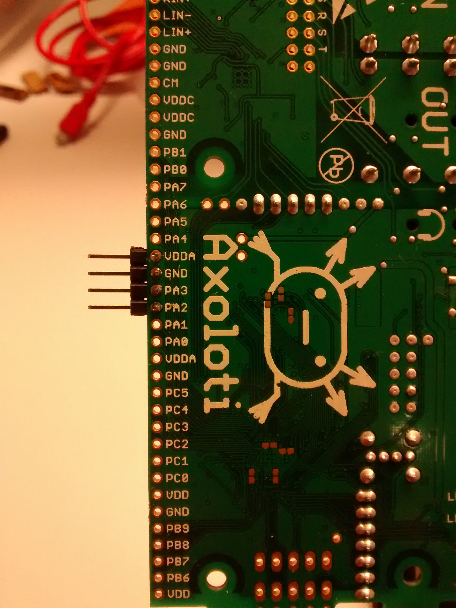
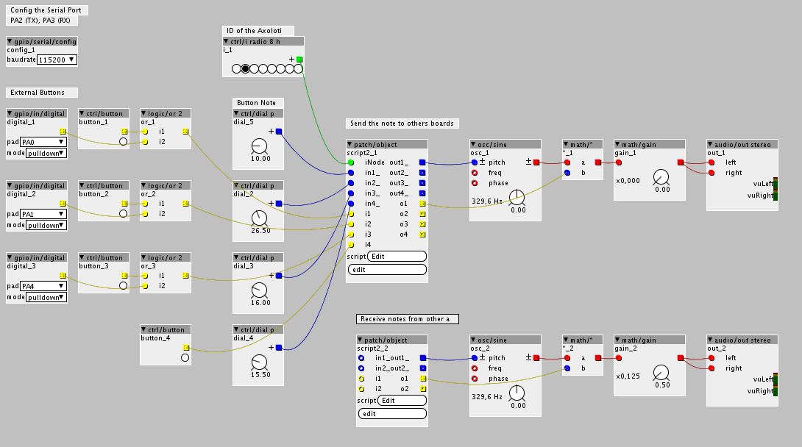

# Axoloti with XBee Prototype

Description of how to communicate Axoloti boards through XBee wireless platform

## Hardware

1. [Axoloti Core boards](http://www.axoloti.com/product/axoloti-core/)
2. XBee modules, We have used  [S2C XBee Pro XBP24CZ7SIT-004](http://tienda.bricogeek.com/modulos-radiofrecuencia/229-xbee-pro-63mw-s2c-rpsma.html)  
3. [XBee Explorer USB](https://www.sparkfun.com/products/11812). For configurated the XBee modulo via PC
4. micro-USB and mini_USB wires
5. Electronics tools, Jumper wires, breadboard, headers, etc

## Software

1. [Axoloti IDE](http://community.axoloti.com/t/quick-start-guide/57)
2. [XCTU](https://www.digi.com/products/xbee-rf-solutions/xctu-software/xctu) (XBee module configuration)

## XBee configuration

The idea of our prototype is send music notes from one axoloti to all the others boards. The XBee was tested with different configurations. The configuration more efficient was the transmision mode with the Digi Mesh firmware, that configuration build a DigiMesh Network.

So, update the DigiMesh 2.4 TH PRO firmware in each XBee module through the XCTU software, and configurate the modules. The parameters for the configurations are in this repository.

Some important parameters:

CH Channel = C

ID Network ID = 1234

CE Coordinator/End-Device Node = Standard Router [0]

DH Destination Address High = 0

DL Destination Address Low  = FFFF

AP API Enable = Transparation Mode[0]

## Hardware conections

For convenience we solder headers in the boards how you can see in the picture. The conections are:

XBee module -> Axoloti board

GND  -> GND

3.3v -> VDDA

DOUT -> PA3

DIN  -> PA2

## Axoloti Patch

The Axoloti Patch do some things, receive a signal in the pins PA0, PA1 and PA4, and generate a note from then. This note are sends through the serial port (pin PA2 TX). At the same time, the board receive a message from other boards to generated a note.

The message send o receive consist in 5 byte, the byte are: start of the message (.), state of the note (ON or OFF, 0 or 1), Axoloti ID, Note, end of the message (#).

